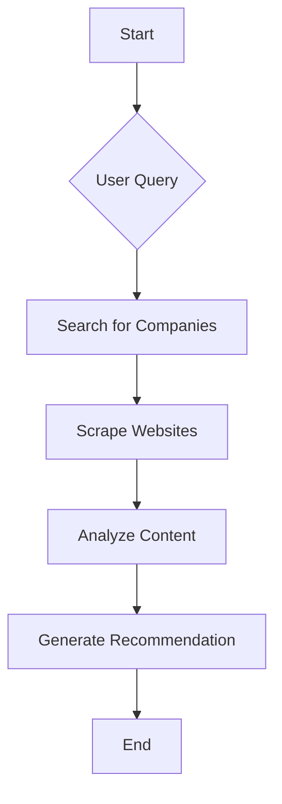

# 🔭 Advance Agent – Your AI‑Powered Developer‑Tools Research Assistant


[](https://opensource.org/licenses/MIT)

An advanced command‑line research agent that automates discovering and analysing the best developer tools for you.  
Enter a query, and the agent will:

1. Search the web for relevant companies.
2. Scrape their official websites.
3. Generate a detailed analysis and a clear recommendation.

---

https://github.com/user-attachments/assets/e8e43e1c-d642-4761-b8a3-92883fdde7ef

## 🚀 Features

| Icon | Feature | Description |
|------|--------|-------------|
| 🔎 | **Intelligent Search** | Uses Google Gemini to surface the most relevant tool companies. |
| 📋 | **Automated Web Scraping** | Firecrawl fetches all publicly visible content from each company’s website. |
| 📊 | **In‑Depth Analysis** | LangGraph + Gemini parse the scraped data to pull out tech stack, pricing, API integrations, and more. |
| ✅ | **Actionable Recommendations** | Final digest summarises everything and suggests the best fit for your needs. |
| 🛠️ | **Extensible Workflow** | Built on LangGraph – add new nodes or replace Gemini with another LLM with minimal effort. |

---

## 📖 How It Works

The agent follows a three‑step workflow orchestrated by **LangGraph**:

1. **Search** – Query Gemini for a list of companies matching the user’s request.  
2. **Scrape** – Firecrawl crawls each company’s website, returning structured HTML/text.  
3. **Analyze** – Gemini parses the data, extracts key facts, and produces a recommendation.


---
## 🛠️ Technologies Used
*   **Python**
*   **LangChain & LangGraph** – Workflow orchestration
*   **Google Gemini** – LLM for search & analysis
*   **Firecrawl** – Web‑scraping engine
*   **Pydantic** – Structured state management
*(and the usual data‑science stack: pandas, numpy, etc.)*

---

## ⚙️ Setup and Installation
### 1. Clone the repository

```bash
git clone https://github.com/MAYOR-G/advance-agent.git
cd advance-agent
```
### 2. Create & activate a virtual environment
```bash
python -m venv .venv
```
**Windows**
```bash
.venv\Scripts\activate
```
**macOS/Linux**
```bash
source .venv/bin/activate
```
### 3. Install dependencies
```bash
pip install -r requirements.txt
```
If you don’t have `requirements.txt`, generate one from `pyproject.toml`:
```bash
pip freeze > requirements.txt
```
### 4. Create a `.env` file
```bash
touch .env
```
Add your API keys:
```
GOOGLE_API_KEY=your-google-api-key
FIRECRAWL_API_KEY=your-firecrawl-api-key
```
Get them from: [Google AI Studio](https://aistudio.google.com/) & [Firecrawl](https://firecrawl.dev/).

---

## 🚀 Usage
Run the agent:
```bash
python main.py
```
The prompt will ask for a query. For example:
```
 Developer Tools Query --->>: open-source logging and monitoring tools
```
The agent will then:

1.  Search for relevant companies
2.  Scrape each site
3.  Analyse the content
4.  Display a concise report

---

## 📂 Project Structure
```
advance-agent/
├── src/
│   ├── __init__.py
│   ├── nodes.py        # Defines LangGraph nodes
│   ├── state.py        # Pydantic state schema
│   └── workflow.py     # LangGraph workflow assembly
├── .env                # API keys & env vars
├── .gitignore
├── main.py              # Entry point
├── pyproject.toml      # Poetry / PDM config
├── README.md
└── ... (other assets)
```
---

## 🤝 Contributing
We welcome improvements! Follow these steps:

1.  Fork the repo
2.  Create a feature branch (`git checkout -b feature/your-feature`)
3.  Commit your changes (`git commit -m "Add some feature"`)
4.  Push to origin (`git push origin feature/your-feature`)
5.  Open a pull request

---

## 📜 License
MIT © mayor g

